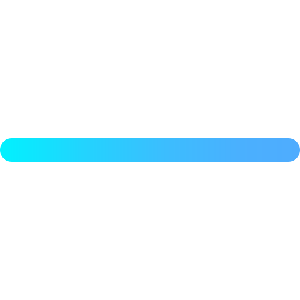

<h1 align="center"> Hi there 👋 This is Ritik Singh Sahib</h1>

 
<h2> Technologies worked on :-</h2>

  
 
 
  
  
  

  
  <h3> Technologies working on :-</h3>
  
  

  
  
  
  

> Recent Action .

- [:heavy_check_mark:] 1. Scripting.
- [:heavy_check_mark:] 2. Data Wrangling.
- [:memo:] 3. Machine Learning.
- [:memo:] 4. Automation

  

